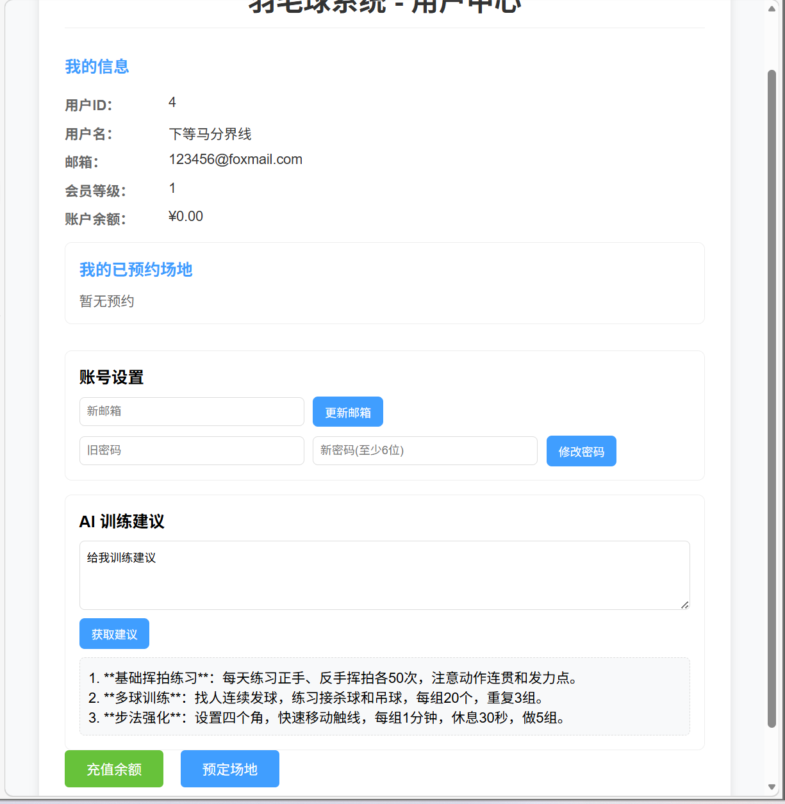
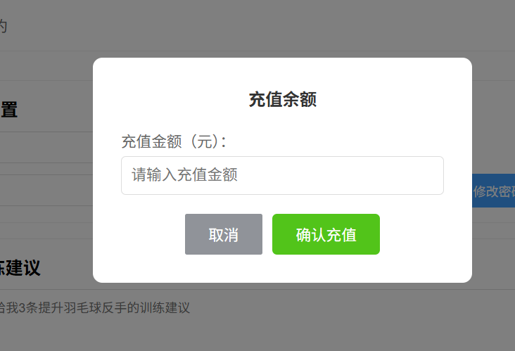
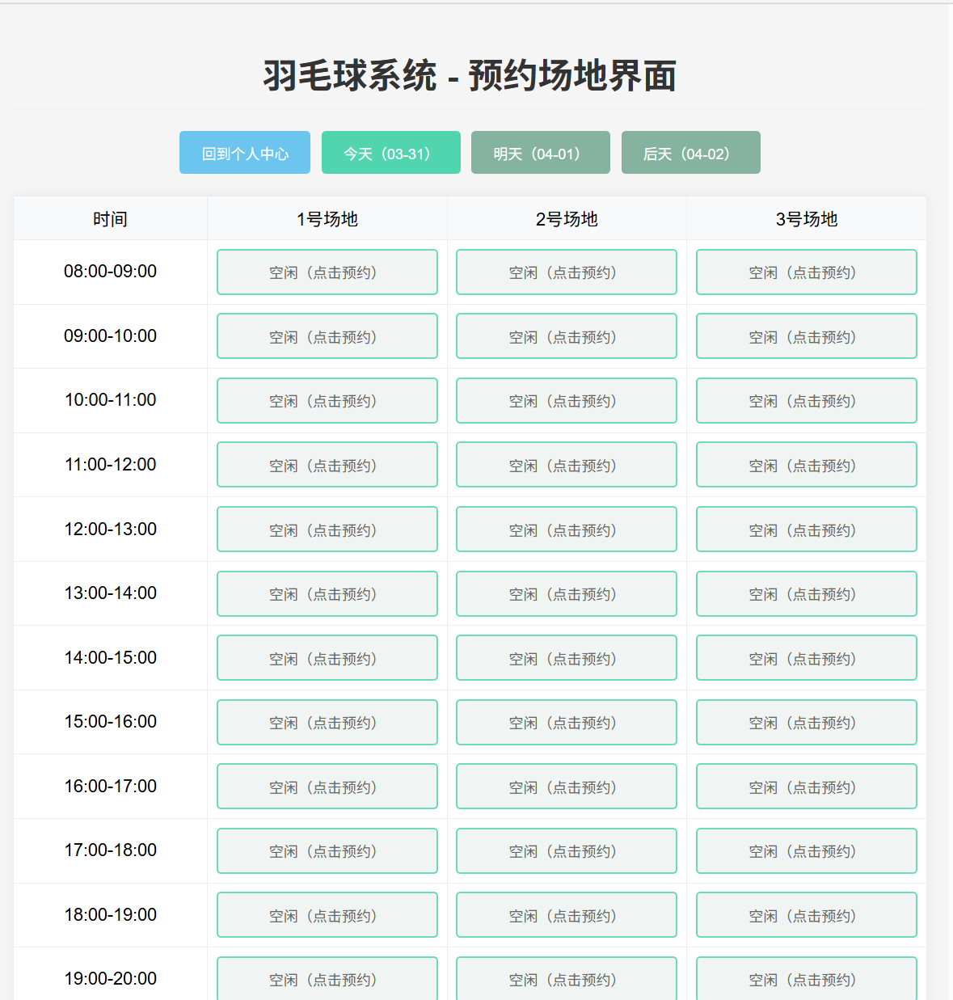
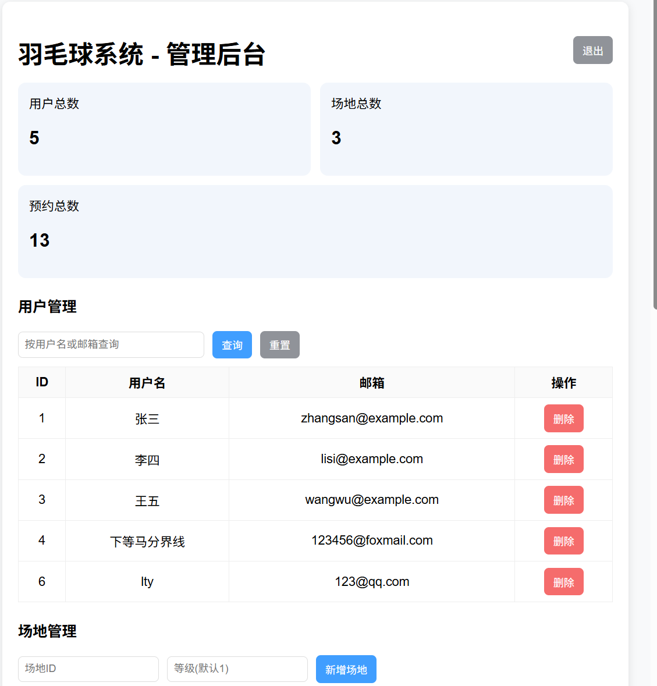
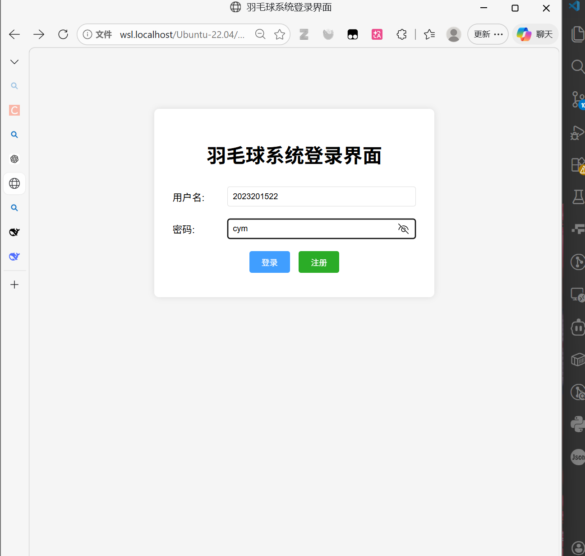

# 羽毛球系统课程项目报告

## 项目概述
本项目在原有基础上新增了用户资料维护、密码修改、余额充值、后台管理查询与维护、AI 训练建议等模块，满足“至少6—7个功能模块”和“数据库访问 + AI API 调用”要求。

---

## 功能模块清单（共 7 项）

1. 用户管理模块（用户表 CRUD）  
说明：注册、登录、查看用户资料、更新邮箱、修改密码。  
截图：`images/用户界面.png`


2. 账户充值模块（账户表更新）  
说明：用户充值余额，余额实时刷新。  
截图：`images/充值弹窗.png`


3. 场地预约模块（预约表 CRUD）  
说明：查询预约、创建预约、取消预约。  
截图：`images/预约场地界面.png`


4. 场地管理模块（场地表 CRUD）  
说明：管理员新增/删除场地、修改场地等级。  
截图：`images/管理界面.png`


5. 管理员用户与预约管理模块（含查询）  
说明：后台查看用户列表、删除用户、查询用户；查看预约并按条件查询与删除。  
截图：`images/管理界面.png`


6. 数据库访问模块  
说明：FastAPI 调用 MySQL，完成用户、账户、场地、预约等表的查询与事务更新。  
截图：`images/登录界面.png`


7. AI 智能建议模块（调用人工智能 API）  
说明：用户输入问题，系统调用 DeepSeek API 返回训练建议。  
截图：无

---

## 界面截图（已提供）
- 用户界面、充值弹窗、预约场地界面、管理界面、登录界面

---

## 核心功能说明与代码片段

### 1) 用户资料更新（邮箱）
功能：用户在“账号设置”更新邮箱，服务端写入 User 表。  
核心代码：`api/api.py`

```python
@app.post("/users/{username}/profile", summary="更新用户资料")
def update_user_profile(username: str, req: UpdateProfileRequest):
  ok = system.update_user_email(username, req.email)
  if not ok:
    raise HTTPException(status_code=400, detail="更新失败")
  return {"message": "update success"}
```

### 2) 用户修改密码
功能：校验旧密码后更新新密码。  
核心代码：`badminton_sys/badminton_sys.py`

```python
def update_user_password(self, username, old_password, new_password):
  if not self.check_password(username, old_password):
    return False
  sql = "UPDATE User SET password = %s WHERE name = %s"
  self.cursor.execute(sql, (self._encrypt_password(new_password), username))
  self.db.commit()
  return True
```

### 3) 余额充值
功能：前端发起充值请求，后端更新 Account 表余额。  
核心代码：`api/api.py`

```python
@app.post("/users/{username}/recharge", summary="用户充值")
def recharge_user(username: str, req: RechargeRequest):
  new_balance = system.recharge_balance(username, req.amount)
  if new_balance is None:
    raise HTTPException(status_code=400, detail="充值失败")
  return {"message": "recharge success", "new_balance": new_balance}
```

### 4) 管理员修改场地等级
功能：后台列表中直接修改场地等级。  
核心代码：`pages/admin.html`

```js
const res = await fetch(`${API}/admin/courts/${courtId}`, {
  method: "PUT",
  headers: adminHeaders(),
  body: JSON.stringify({ level })
});
```

### 5) 管理员查询（用户与预约）
功能：前端对用户列表与预约列表进行条件筛选展示。  
核心代码：`pages/admin.html`

```js
const filtered = allUsersCache.filter(u =>
  String(u.username || "").toLowerCase().includes(key) ||
  String(u.email || "").toLowerCase().includes(key)
);
renderUsers(filtered);
```

### 6) AI 智能建议（DeepSeek）
功能：输入训练问题，调用 DeepSeek API 生成建议。  
核心代码：`api/api.py`

```python
response = requests.post(
  "https://api.deepseek.com/chat/completions",
  headers={"Authorization": f"Bearer {api_key}"},
  json={
    "model": model,
    "messages": [
      {"role": "system", "content": "你是羽毛球训练助理，给出清晰、可执行的训练建议。"},
      {"role": "user", "content": prompt}
    ],
    "stream": False
  }
)
```

---

## 数据库访问说明
- 通过 `BadmintonSystem` 连接 MySQL 数据库，执行查询与更新操作。  
- 事务通过 `commit()` 提交，异常时回滚保证一致性。  
- 涉及表：`User`、`Account`、`Court`、`CourtReservation`。  

---

## 运行与测试步骤
1. 启动后端（FastAPI）

```bash
cd <你的项目根目录>
python3 -m uvicorn api.api:app --reload --host 127.0.0.1 --port 8001
```

2. 打开前端页面  
直接在浏览器中打开：
`<你的项目根目录>/pages/login.html`

3. AI 功能配置（申请优秀必须完成）

```bash
export DEEPSEEK_API_KEY="你的API Key"
# 可选：指定模型
export DEEPSEEK_MODEL="deepseek-chat"
```

4. 关键功能验证  
- 注册/登录  
- 用户中心信息、充值、修改邮箱与密码  
- 预约场地与取消预约  
- 管理员后台（用户管理、场地管理、预约管理、场地等级更新、查询功能）  
- AI 训练建议输出

---

## 管理员账号说明
默认管理员账号：  
- 用户名：`admin`  
- 密码：`Admin@123`  
管理员登录成功后可进入后台执行用户、场地与预约管理。
